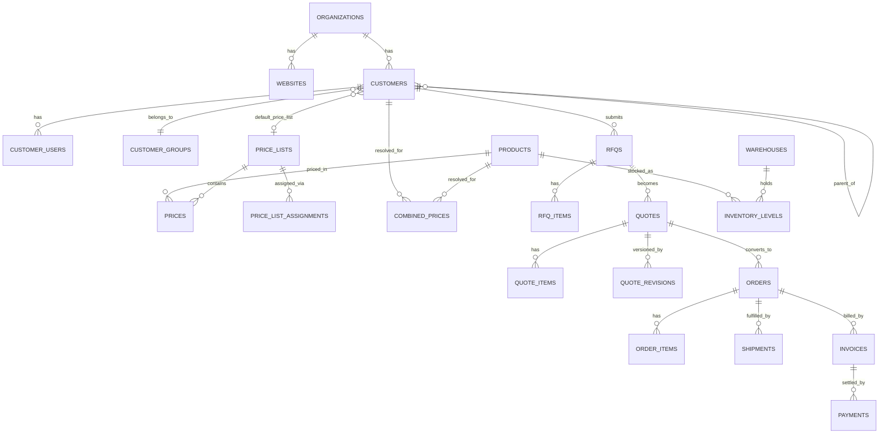

# Module Specifications & PostgreSQL Schema
## In-House B2B Commerce Platform — implementation pack v0.1

| Field | Value |
|---|---|
| Companion to | PRD v0.2 (In-House B2B Commerce Platform) |
| Stack | Go (chi + sqlc) · PostgreSQL 16+ · Vue (admin) + Nuxt (storefront) |
| Scope of this pack | MVP→V1 commerce spine at full depth; supporting modules forward-compatible |
| Status | Draft v0.1 |
| Last updated | 2 June 2026 |

This document is meant to be wired up directly. The schema is one coherent set — every foreign key resolves to a table defined here. Build order is in §13.

---

## 0. Conventions (read first)

These apply to every table and avoid the "bumping here and there" problem.

- **PKs**: `id BIGINT GENERATED ALWAYS AS IDENTITY PRIMARY KEY`.
- **Public identifiers**: customer-facing documents (orders, quotes, RFQs, invoices, payments) also carry `public_id UUID NOT NULL DEFAULT gen_random_uuid()` (needs `pgcrypto` or `uuid-ossp`; Postgres 16 has `gen_random_uuid()` built in). Never expose raw `id` in URLs/APIs — use `public_id`.
- **Timestamps**: `created_at timestamptz NOT NULL DEFAULT now()`, `updated_at timestamptz NOT NULL DEFAULT now()` (bump `updated_at` via trigger or in the repo layer).
- **Soft delete**: `deleted_at timestamptz` only where business needs it (products, customers, price lists). Hard-delete everything else.
- **Money**: `NUMERIC(15,4)`. Never float. Currency is `CHAR(3)` (ISO 4217).
- **Quantities**: `NUMERIC(15,4)` (B2B sells fractional/UOM quantities).
- **Enums**: `text` + `CHECK` constraint, not native `ENUM` (Postgres enums are painful to alter). Status vocabularies are listed per table.
- **Flexible data**: `JSONB` with `GIN` index for product attributes and document snapshots.
- **Naming**: tables plural snake_case; FK columns `<singular>_id`; join tables `<a>_<b>`.
- **Multi-tenant boundary**: most domain tables carry `organization_id`. Enforce tenant isolation in the query layer (every query filters by org).
- **sqlc**: write hand SQL; let sqlc generate Go. The tricky queries (§12) are written out so you generate type-safe methods directly.

Shared trigger for `updated_at` (apply to every table with the column):

```sql
CREATE OR REPLACE FUNCTION set_updated_at() RETURNS trigger AS $$
BEGIN NEW.updated_at = now(); RETURN NEW; END;
$$ LANGUAGE plpgsql;
-- per table: CREATE TRIGGER trg_set_updated_at BEFORE UPDATE ON <table>
--   FOR EACH ROW EXECUTE FUNCTION set_updated_at();
```

---

## 1. Foundation: organizations, websites, users, RBAC

### User stories
- As a **system admin**, I can manage one or more seller organizations so a single install can serve multiple brands/business units.
- As a **system admin**, I can run multiple websites under an organization, each with its own domain, currency, and locale.
- As a **system admin**, I can assign roles to back-office users so access is governed by permissions, not ad-hoc.

### Acceptance criteria
- Creating a website requires a valid `organization_id`, a unique `domain`, and a default currency/locale.
- A back-office user with no role assignment has zero permissions (deny by default).
- Deactivating a user (`is_active=false`) blocks login immediately but preserves their audit trail.

### Schema
```sql
CREATE TABLE organizations (
  id            BIGINT GENERATED ALWAYS AS IDENTITY PRIMARY KEY,
  name          text NOT NULL,
  is_active     boolean NOT NULL DEFAULT true,
  created_at    timestamptz NOT NULL DEFAULT now(),
  updated_at    timestamptz NOT NULL DEFAULT now()
);

CREATE TABLE websites (
  id                BIGINT GENERATED ALWAYS AS IDENTITY PRIMARY KEY,
  organization_id   BIGINT NOT NULL REFERENCES organizations(id),
  name              text NOT NULL,
  domain            text NOT NULL UNIQUE,
  default_currency  CHAR(3) NOT NULL,
  default_locale    text NOT NULL DEFAULT 'en',
  is_active         boolean NOT NULL DEFAULT true,
  created_at        timestamptz NOT NULL DEFAULT now(),
  updated_at        timestamptz NOT NULL DEFAULT now()
);
CREATE INDEX idx_websites_org ON websites(organization_id);

-- Seller-side back-office users
CREATE TABLE users (
  id              BIGINT GENERATED ALWAYS AS IDENTITY PRIMARY KEY,
  organization_id BIGINT NOT NULL REFERENCES organizations(id),
  email           citext NOT NULL,          -- requires CREATE EXTENSION citext;
  password_hash   text NOT NULL,
  full_name       text NOT NULL,
  is_active       boolean NOT NULL DEFAULT true,
  last_login_at   timestamptz,
  created_at      timestamptz NOT NULL DEFAULT now(),
  updated_at      timestamptz NOT NULL DEFAULT now(),
  UNIQUE (organization_id, email)
);

CREATE TABLE roles (
  id              BIGINT GENERATED ALWAYS AS IDENTITY PRIMARY KEY,
  organization_id BIGINT NOT NULL REFERENCES organizations(id),
  name            text NOT NULL,
  description     text,
  UNIQUE (organization_id, name)
);

-- Permission keys are app-defined strings, e.g. 'order.view', 'product.edit', 'price_list.manage'
CREATE TABLE role_permissions (
  role_id     BIGINT NOT NULL REFERENCES roles(id) ON DELETE CASCADE,
  permission  text   NOT NULL,
  PRIMARY KEY (role_id, permission)
);

CREATE TABLE user_roles (
  user_id BIGINT NOT NULL REFERENCES users(id) ON DELETE CASCADE,
  role_id BIGINT NOT NULL REFERENCES roles(id) ON DELETE CASCADE,
  PRIMARY KEY (user_id, role_id)
);
```

### API surface (representative)
`POST /admin/orgs`, `POST /admin/websites`, `POST /admin/users`, `POST /admin/users/{id}/roles`, `GET /admin/me/permissions`.

---

## 2. Customers & accounts (B2B core)

### User stories
- As a **seller admin**, I can create a customer company with billing terms, credit limit, and an assigned price list.
- As a **seller admin**, I can nest customers (HQ → branches) so pricing and catalog visibility inherit down the tree.
- As a **buyer admin**, I can manage my company's users and assign them roles (buyer / approver / admin).
- As a **buyer**, I see only prices and products my company is entitled to.

### Acceptance criteria
- A customer's effective price list resolves from its own assignment, else inherits from the nearest ancestor, else the website default (see §5).
- Setting `parent_id` cannot create a cycle (enforced in app via the ancestor CTE in §12.2).
- A `customer_user` with role `buyer` cannot place an order above their `spending_limit` without an approval (§10).

### Schema
```sql
CREATE TABLE customer_groups (
  id              BIGINT GENERATED ALWAYS AS IDENTITY PRIMARY KEY,
  organization_id BIGINT NOT NULL REFERENCES organizations(id),
  name            text NOT NULL,
  UNIQUE (organization_id, name)
);

CREATE TABLE customers (
  id                    BIGINT GENERATED ALWAYS AS IDENTITY PRIMARY KEY,
  public_id             UUID NOT NULL DEFAULT gen_random_uuid() UNIQUE,
  organization_id       BIGINT NOT NULL REFERENCES organizations(id),
  parent_id             BIGINT REFERENCES customers(id),          -- hierarchy
  customer_group_id     BIGINT REFERENCES customer_groups(id),
  name                  text NOT NULL,
  tax_id                text,
  payment_terms_days    int NOT NULL DEFAULT 0,                   -- 0 = prepay
  credit_limit          NUMERIC(15,4) NOT NULL DEFAULT 0,
  default_price_list_id BIGINT,                                    -- FK added in §5
  assigned_sales_rep_id BIGINT REFERENCES users(id),
  is_active             boolean NOT NULL DEFAULT true,
  created_at            timestamptz NOT NULL DEFAULT now(),
  updated_at            timestamptz NOT NULL DEFAULT now(),
  deleted_at            timestamptz
);
CREATE INDEX idx_customers_org ON customers(organization_id);
CREATE INDEX idx_customers_parent ON customers(parent_id);

CREATE TABLE customer_users (
  id              BIGINT GENERATED ALWAYS AS IDENTITY PRIMARY KEY,
  customer_id     BIGINT NOT NULL REFERENCES customers(id),
  email           citext NOT NULL,
  password_hash   text NOT NULL,
  full_name       text NOT NULL,
  role            text NOT NULL DEFAULT 'buyer'
                    CHECK (role IN ('buyer','approver','admin')),
  spending_limit  NUMERIC(15,4),                -- null = unlimited (subject to credit_limit)
  is_active       boolean NOT NULL DEFAULT true,
  created_at      timestamptz NOT NULL DEFAULT now(),
  updated_at      timestamptz NOT NULL DEFAULT now(),
  UNIQUE (customer_id, email)
);

CREATE TABLE customer_addresses (
  id           BIGINT GENERATED ALWAYS AS IDENTITY PRIMARY KEY,
  customer_id  BIGINT NOT NULL REFERENCES customers(id),
  type         text NOT NULL CHECK (type IN ('billing','shipping')),
  is_default   boolean NOT NULL DEFAULT false,
  line1        text NOT NULL,
  line2        text,
  city         text NOT NULL,
  region       text,
  postal_code  text,
  country      CHAR(2) NOT NULL,
  created_at   timestamptz NOT NULL DEFAULT now(),
  updated_at   timestamptz NOT NULL DEFAULT now()
);
CREATE INDEX idx_customer_addresses_cust ON customer_addresses(customer_id);
```

---

## 3. Catalog & PIM

### User stories
- As a **catalog manager**, I define attribute families so different product types carry different fields.
- As a **catalog manager**, I create simple and configurable (variant) products with flexible attributes.
- As a **catalog manager**, I organize products into a category tree and control per-customer visibility.
- As a **buyer**, I browse and filter products by attributes (facets).

### Acceptance criteria
- A product's attributes validate against its attribute family's defined attributes (app-level on write).
- A configurable product's variants each set the family's `is_variant_axis` attributes to distinct combinations.
- Catalog visibility: if any visibility rows exist for a customer/group, the catalog is restricted to them; if none exist, all active products are visible.

### Schema
```sql
CREATE TABLE attribute_families (
  id              BIGINT GENERATED ALWAYS AS IDENTITY PRIMARY KEY,
  organization_id BIGINT NOT NULL REFERENCES organizations(id),
  name            text NOT NULL,
  UNIQUE (organization_id, name)
);

CREATE TABLE attributes (
  id              BIGINT GENERATED ALWAYS AS IDENTITY PRIMARY KEY,
  organization_id BIGINT NOT NULL REFERENCES organizations(id),
  code            text NOT NULL,            -- machine key used in products.attributes JSONB
  label           text NOT NULL,
  data_type       text NOT NULL CHECK (data_type IN
                    ('text','number','boolean','select','multiselect','date','file','price')),
  options         JSONB,                    -- for select/multiselect: ["red","blue"]
  is_filterable   boolean NOT NULL DEFAULT false,
  is_variant_axis boolean NOT NULL DEFAULT false,
  UNIQUE (organization_id, code)
);

CREATE TABLE attribute_family_attributes (
  family_id    BIGINT NOT NULL REFERENCES attribute_families(id) ON DELETE CASCADE,
  attribute_id BIGINT NOT NULL REFERENCES attributes(id) ON DELETE CASCADE,
  is_required  boolean NOT NULL DEFAULT false,
  sort_order   int NOT NULL DEFAULT 0,
  PRIMARY KEY (family_id, attribute_id)
);

CREATE TABLE products (
  id                  BIGINT GENERATED ALWAYS AS IDENTITY PRIMARY KEY,
  public_id           UUID NOT NULL DEFAULT gen_random_uuid() UNIQUE,
  organization_id     BIGINT NOT NULL REFERENCES organizations(id),
  sku                 text NOT NULL,
  type                text NOT NULL DEFAULT 'simple'
                        CHECK (type IN ('simple','configurable','kit','digital')),
  parent_id           BIGINT REFERENCES products(id),   -- variant -> configurable parent
  attribute_family_id BIGINT REFERENCES attribute_families(id),
  name                text NOT NULL,
  slug                text NOT NULL,
  description         text,
  status              text NOT NULL DEFAULT 'draft'
                        CHECK (status IN ('draft','active','disabled')),
  attributes          JSONB NOT NULL DEFAULT '{}'::jsonb,   -- flexible attrs by code
  unit                text NOT NULL DEFAULT 'each',
  created_at          timestamptz NOT NULL DEFAULT now(),
  updated_at          timestamptz NOT NULL DEFAULT now(),
  deleted_at          timestamptz,
  UNIQUE (organization_id, sku)
);
CREATE INDEX idx_products_org ON products(organization_id);
CREATE INDEX idx_products_parent ON products(parent_id);
CREATE INDEX idx_products_attrs_gin ON products USING GIN (attributes);
CREATE UNIQUE INDEX uq_products_slug ON products(organization_id, slug) WHERE deleted_at IS NULL;

CREATE TABLE product_translations (
  product_id  BIGINT NOT NULL REFERENCES products(id) ON DELETE CASCADE,
  locale      text NOT NULL,
  name        text NOT NULL,
  description text,
  PRIMARY KEY (product_id, locale)
);

CREATE TABLE product_media (
  id         BIGINT GENERATED ALWAYS AS IDENTITY PRIMARY KEY,
  product_id BIGINT NOT NULL REFERENCES products(id) ON DELETE CASCADE,
  url        text NOT NULL,
  type       text NOT NULL DEFAULT 'image' CHECK (type IN ('image','document','video')),
  alt        text,
  sort_order int NOT NULL DEFAULT 0
);
CREATE INDEX idx_product_media_product ON product_media(product_id);

CREATE TABLE categories (
  id              BIGINT GENERATED ALWAYS AS IDENTITY PRIMARY KEY,
  organization_id BIGINT NOT NULL REFERENCES organizations(id),
  parent_id       BIGINT REFERENCES categories(id),
  name            text NOT NULL,
  slug            text NOT NULL,
  sort_order      int NOT NULL DEFAULT 0,
  UNIQUE (organization_id, slug)
);
CREATE INDEX idx_categories_parent ON categories(parent_id);

CREATE TABLE product_categories (
  product_id  BIGINT NOT NULL REFERENCES products(id) ON DELETE CASCADE,
  category_id BIGINT NOT NULL REFERENCES categories(id) ON DELETE CASCADE,
  PRIMARY KEY (product_id, category_id)
);

-- Per-customer / per-group visibility. No rows for an actor = full visibility.
CREATE TABLE catalog_visibility (
  id                BIGINT GENERATED ALWAYS AS IDENTITY PRIMARY KEY,
  product_id        BIGINT REFERENCES products(id) ON DELETE CASCADE,
  category_id       BIGINT REFERENCES categories(id) ON DELETE CASCADE,
  customer_id       BIGINT REFERENCES customers(id) ON DELETE CASCADE,
  customer_group_id BIGINT REFERENCES customer_groups(id) ON DELETE CASCADE,
  visible           boolean NOT NULL DEFAULT true,
  CHECK ( (product_id IS NOT NULL)::int + (category_id IS NOT NULL)::int = 1 ),
  CHECK ( (customer_id IS NOT NULL)::int + (customer_group_id IS NOT NULL)::int = 1 )
);
```

---

## 4. Pricing engine (deep)

The most B2B-distinctive subsystem. Treat resolution as deterministic and cache the result.

### User stories
- As a **pricing manager**, I create named price lists (per currency) and assign them to customers, groups, or websites with a priority order.
- As a **pricing manager**, I set tiered prices (price breaks by quantity) and customer-specific overrides.
- As a **buyer**, I always see *my* contract price for a product at a given quantity, in my currency.
- As the **system**, I precompute resolved prices so storefront reads are O(1), and I recompute asynchronously when inputs change.

### Acceptance criteria
- Given a `(customer, product, quantity, currency, website, date)`, price resolution returns exactly one unit price plus a trace of which price list/rule applied.
- Assignment priority: **customer > customer_group > website default**. Within the same level, higher `priority` wins. Ties broken by most specific quantity tier ≤ requested qty.
- Time-bounded prices outside `[valid_from, valid_to]` are ignored.
- Changing a price, assignment, or a customer's group enqueues a recompute job for the affected combined prices (river job).
- If no price resolves, the product is "price on request" (RFQ path), not free.

### Schema
```sql
CREATE TABLE price_lists (
  id              BIGINT GENERATED ALWAYS AS IDENTITY PRIMARY KEY,
  organization_id BIGINT NOT NULL REFERENCES organizations(id),
  name            text NOT NULL,
  currency        CHAR(3) NOT NULL,
  is_default      boolean NOT NULL DEFAULT false,
  is_active       boolean NOT NULL DEFAULT true,
  created_at      timestamptz NOT NULL DEFAULT now(),
  updated_at      timestamptz NOT NULL DEFAULT now(),
  deleted_at      timestamptz,
  UNIQUE (organization_id, name)
);

-- Backfill the FK declared in §2
ALTER TABLE customers
  ADD CONSTRAINT fk_customers_default_price_list
  FOREIGN KEY (default_price_list_id) REFERENCES price_lists(id);

CREATE TABLE prices (
  id            BIGINT GENERATED ALWAYS AS IDENTITY PRIMARY KEY,
  price_list_id BIGINT NOT NULL REFERENCES price_lists(id) ON DELETE CASCADE,
  product_id    BIGINT NOT NULL REFERENCES products(id) ON DELETE CASCADE,
  unit          text NOT NULL DEFAULT 'each',
  min_quantity  NUMERIC(15,4) NOT NULL DEFAULT 1,      -- tier threshold
  value         NUMERIC(15,4) NOT NULL,
  valid_from    timestamptz,
  valid_to      timestamptz,
  created_at    timestamptz NOT NULL DEFAULT now(),
  UNIQUE (price_list_id, product_id, unit, min_quantity)
);
CREATE INDEX idx_prices_product ON prices(product_id);

CREATE TABLE price_list_assignments (
  id                BIGINT GENERATED ALWAYS AS IDENTITY PRIMARY KEY,
  price_list_id     BIGINT NOT NULL REFERENCES price_lists(id) ON DELETE CASCADE,
  customer_id       BIGINT REFERENCES customers(id) ON DELETE CASCADE,
  customer_group_id BIGINT REFERENCES customer_groups(id) ON DELETE CASCADE,
  website_id        BIGINT REFERENCES websites(id) ON DELETE CASCADE,
  priority          int NOT NULL DEFAULT 0,            -- higher wins within a level
  CHECK ( (customer_id IS NOT NULL)::int
        + (customer_group_id IS NOT NULL)::int
        + (website_id IS NOT NULL)::int = 1 )
);
CREATE INDEX idx_pla_customer ON price_list_assignments(customer_id);
CREATE INDEX idx_pla_group ON price_list_assignments(customer_group_id);
CREATE INDEX idx_pla_website ON price_list_assignments(website_id);

-- Precomputed resolved prices (the read path for the storefront).
-- Rebuilt per (customer, product) by a worker. Group/website fallbacks
-- are flattened into per-customer rows at compute time for O(1) reads.
CREATE TABLE combined_prices (
  customer_id   BIGINT NOT NULL REFERENCES customers(id) ON DELETE CASCADE,
  product_id    BIGINT NOT NULL REFERENCES products(id) ON DELETE CASCADE,
  unit          text NOT NULL DEFAULT 'each',
  min_quantity  NUMERIC(15,4) NOT NULL DEFAULT 1,
  currency      CHAR(3) NOT NULL,
  value         NUMERIC(15,4) NOT NULL,
  source_price_list_id BIGINT REFERENCES price_lists(id),  -- trace
  computed_at   timestamptz NOT NULL DEFAULT now(),
  PRIMARY KEY (customer_id, product_id, unit, min_quantity, currency)
);
```

The resolution query and the recompute trigger logic are in §12.1.

---

## 5. Cart & shopping lists

### User stories
- As a **buyer**, I keep multiple saved shopping lists (reorder templates) and turn one into a cart or an RFQ.
- As a **buyer**, I add items to a cart, see line and cart totals with my pricing, and proceed to checkout.

### Acceptance criteria
- A cart line's `unit_price` is read from `combined_prices` at add-time and re-validated at checkout (price drift handled gracefully).
- Converting a shopping list to a cart copies items and resolves current prices.
- A customer may have many shopping lists but at most one `is_default = true`.

### Schema
```sql
CREATE TABLE shopping_lists (
  id               BIGINT GENERATED ALWAYS AS IDENTITY PRIMARY KEY,
  customer_id      BIGINT NOT NULL REFERENCES customers(id) ON DELETE CASCADE,
  customer_user_id BIGINT REFERENCES customer_users(id),
  name             text NOT NULL,
  is_default       boolean NOT NULL DEFAULT false,
  created_at       timestamptz NOT NULL DEFAULT now(),
  updated_at       timestamptz NOT NULL DEFAULT now()
);
CREATE UNIQUE INDEX uq_one_default_list ON shopping_lists(customer_id) WHERE is_default;

CREATE TABLE shopping_list_items (
  id               BIGINT GENERATED ALWAYS AS IDENTITY PRIMARY KEY,
  shopping_list_id BIGINT NOT NULL REFERENCES shopping_lists(id) ON DELETE CASCADE,
  product_id       BIGINT NOT NULL REFERENCES products(id),
  quantity         NUMERIC(15,4) NOT NULL DEFAULT 1,
  unit             text NOT NULL DEFAULT 'each'
);

CREATE TABLE carts (
  id               BIGINT GENERATED ALWAYS AS IDENTITY PRIMARY KEY,
  public_id        UUID NOT NULL DEFAULT gen_random_uuid() UNIQUE,
  customer_id      BIGINT NOT NULL REFERENCES customers(id),
  customer_user_id BIGINT REFERENCES customer_users(id),
  website_id       BIGINT NOT NULL REFERENCES websites(id),
  currency         CHAR(3) NOT NULL,
  status           text NOT NULL DEFAULT 'active'
                     CHECK (status IN ('active','converted','abandoned')),
  created_at       timestamptz NOT NULL DEFAULT now(),
  updated_at       timestamptz NOT NULL DEFAULT now()
);

CREATE TABLE cart_items (
  id          BIGINT GENERATED ALWAYS AS IDENTITY PRIMARY KEY,
  cart_id     BIGINT NOT NULL REFERENCES carts(id) ON DELETE CASCADE,
  product_id  BIGINT NOT NULL REFERENCES products(id),
  quantity    NUMERIC(15,4) NOT NULL,
  unit        text NOT NULL DEFAULT 'each',
  unit_price  NUMERIC(15,4) NOT NULL,        -- snapshot at add-time
  UNIQUE (cart_id, product_id, unit)
);
```

---

## 6. RFQ → Quote → Order (deep)

The B2B negotiation spine. One thread can flow buyer-initiated (RFQ) or seller-initiated (quote), and an accepted quote becomes an order with no re-entry.

### User stories
- As a **buyer**, I submit an RFQ with items, quantities, and optional target prices and notes.
- As a **sales rep**, I turn an RFQ into a quote, adjust line prices/quantities/discounts, set a validity date, and send it back.
- As a **buyer/sales rep**, we negotiate over multiple rounds, with each revision preserved.
- As a **buyer**, I accept a quote and it converts to an order without re-keying anything.
- As a **sales rep**, I can place an order on behalf of a customer.

### Acceptance criteria
- An RFQ moves `draft → submitted → quoted → (accepted | declined | expired)`.
- Creating a quote from an RFQ copies items 1:1; the rep may then edit lines.
- Every quote edit after `sent` creates a new `quote_revisions` snapshot; `quotes.version` increments.
- A quote past `valid_until` cannot be accepted (status auto-flips to `expired` via a scheduled job).
- Accepting a quote (status `accepted`) creates an order in a single transaction; the order references the quote; quote becomes `accepted` and is immutable thereafter.
- Order creation snapshots prices, SKUs, names, and addresses (orders are immutable records, not live joins).

### State machines
```
RFQ:    draft -> submitted -> quoted -> accepted | declined | expired | cancelled
QUOTE:  draft -> sent -> (revised -> sent)* -> accepted | declined | expired
ORDER:  pending -> confirmed -> processing -> shipped -> delivered -> closed
                              \-> on_hold ; any -> cancelled (pre-fulfilment)
```

### Schema
```sql
CREATE TABLE rfqs (
  id               BIGINT GENERATED ALWAYS AS IDENTITY PRIMARY KEY,
  public_id        UUID NOT NULL DEFAULT gen_random_uuid() UNIQUE,
  organization_id  BIGINT NOT NULL REFERENCES organizations(id),
  website_id       BIGINT NOT NULL REFERENCES websites(id),
  customer_id      BIGINT NOT NULL REFERENCES customers(id),
  customer_user_id BIGINT REFERENCES customer_users(id),
  status           text NOT NULL DEFAULT 'draft'
                     CHECK (status IN ('draft','submitted','quoted','accepted','declined','expired','cancelled')),
  notes            text,
  created_at       timestamptz NOT NULL DEFAULT now(),
  updated_at       timestamptz NOT NULL DEFAULT now()
);
CREATE INDEX idx_rfqs_customer ON rfqs(customer_id);

CREATE TABLE rfq_items (
  id           BIGINT GENERATED ALWAYS AS IDENTITY PRIMARY KEY,
  rfq_id       BIGINT NOT NULL REFERENCES rfqs(id) ON DELETE CASCADE,
  product_id   BIGINT NOT NULL REFERENCES products(id),
  quantity     NUMERIC(15,4) NOT NULL,
  unit         text NOT NULL DEFAULT 'each',
  target_price NUMERIC(15,4),
  notes        text
);

CREATE TABLE quotes (
  id                 BIGINT GENERATED ALWAYS AS IDENTITY PRIMARY KEY,
  public_id          UUID NOT NULL DEFAULT gen_random_uuid() UNIQUE,
  organization_id    BIGINT NOT NULL REFERENCES organizations(id),
  website_id         BIGINT NOT NULL REFERENCES websites(id),
  customer_id        BIGINT NOT NULL REFERENCES customers(id),
  rfq_id             BIGINT REFERENCES rfqs(id),           -- null = seller-initiated
  sales_rep_user_id  BIGINT REFERENCES users(id),
  status             text NOT NULL DEFAULT 'draft'
                       CHECK (status IN ('draft','sent','revised','accepted','declined','expired')),
  currency           CHAR(3) NOT NULL,
  version            int NOT NULL DEFAULT 1,
  valid_until        timestamptz,
  subtotal           NUMERIC(15,4) NOT NULL DEFAULT 0,
  created_at         timestamptz NOT NULL DEFAULT now(),
  updated_at         timestamptz NOT NULL DEFAULT now()
);
CREATE INDEX idx_quotes_customer ON quotes(customer_id);
CREATE INDEX idx_quotes_rfq ON quotes(rfq_id);

CREATE TABLE quote_items (
  id          BIGINT GENERATED ALWAYS AS IDENTITY PRIMARY KEY,
  quote_id    BIGINT NOT NULL REFERENCES quotes(id) ON DELETE CASCADE,
  product_id  BIGINT NOT NULL REFERENCES products(id),
  quantity    NUMERIC(15,4) NOT NULL,
  unit        text NOT NULL DEFAULT 'each',
  unit_price  NUMERIC(15,4) NOT NULL,
  discount    NUMERIC(15,4) NOT NULL DEFAULT 0,
  row_total   NUMERIC(15,4) NOT NULL
);

-- Immutable negotiation history: one snapshot per sent version.
CREATE TABLE quote_revisions (
  id          BIGINT GENERATED ALWAYS AS IDENTITY PRIMARY KEY,
  quote_id    BIGINT NOT NULL REFERENCES quotes(id) ON DELETE CASCADE,
  version     int NOT NULL,
  snapshot    JSONB NOT NULL,            -- full quote + items at send time
  created_by  text NOT NULL,             -- 'rep:{id}' or 'customer_user:{id}'
  created_at  timestamptz NOT NULL DEFAULT now(),
  UNIQUE (quote_id, version)
);

CREATE TABLE orders (
  id                     BIGINT GENERATED ALWAYS AS IDENTITY PRIMARY KEY,
  public_id              UUID NOT NULL DEFAULT gen_random_uuid() UNIQUE,
  organization_id        BIGINT NOT NULL REFERENCES organizations(id),
  website_id             BIGINT NOT NULL REFERENCES websites(id),
  customer_id            BIGINT NOT NULL REFERENCES customers(id),
  customer_user_id       BIGINT REFERENCES customer_users(id),
  quote_id               BIGINT REFERENCES quotes(id),
  placed_by_sales_rep_id BIGINT REFERENCES users(id),   -- on-behalf-of
  status                 text NOT NULL DEFAULT 'pending'
                           CHECK (status IN ('pending','confirmed','processing','shipped','delivered','closed','on_hold','cancelled')),
  currency               CHAR(3) NOT NULL,
  po_number              text,
  requested_delivery_date date,
  billing_address        JSONB NOT NULL,    -- snapshot
  shipping_address       JSONB NOT NULL,    -- snapshot
  subtotal               NUMERIC(15,4) NOT NULL DEFAULT 0,
  tax_total              NUMERIC(15,4) NOT NULL DEFAULT 0,
  shipping_total         NUMERIC(15,4) NOT NULL DEFAULT 0,
  grand_total            NUMERIC(15,4) NOT NULL DEFAULT 0,
  created_at             timestamptz NOT NULL DEFAULT now(),
  updated_at             timestamptz NOT NULL DEFAULT now()
);
CREATE INDEX idx_orders_customer ON orders(customer_id);
CREATE INDEX idx_orders_status ON orders(status);

CREATE TABLE order_items (
  id          BIGINT GENERATED ALWAYS AS IDENTITY PRIMARY KEY,
  order_id    BIGINT NOT NULL REFERENCES orders(id) ON DELETE CASCADE,
  product_id  BIGINT NOT NULL REFERENCES products(id),
  sku         text NOT NULL,            -- snapshot
  name        text NOT NULL,            -- snapshot
  quantity    NUMERIC(15,4) NOT NULL,
  unit        text NOT NULL DEFAULT 'each',
  unit_price  NUMERIC(15,4) NOT NULL,   -- snapshot
  tax_amount  NUMERIC(15,4) NOT NULL DEFAULT 0,
  row_total   NUMERIC(15,4) NOT NULL
);

CREATE TABLE order_status_history (
  id          BIGINT GENERATED ALWAYS AS IDENTITY PRIMARY KEY,
  order_id    BIGINT NOT NULL REFERENCES orders(id) ON DELETE CASCADE,
  from_status text,
  to_status   text NOT NULL,
  changed_by  text NOT NULL,
  note        text,
  created_at  timestamptz NOT NULL DEFAULT now()
);
```

### API surface (representative)
`POST /storefront/rfqs`, `POST /storefront/rfqs/{public_id}/submit`,
`POST /admin/rfqs/{id}/quote`, `PUT /admin/quotes/{id}`, `POST /admin/quotes/{id}/send`,
`POST /storefront/quotes/{public_id}/accept` (→ order in one tx),
`POST /admin/orders` (rep on-behalf-of), `PATCH /admin/orders/{id}/status`.

---

## 7. Order-to-cash: shipments, invoices, payments

### User stories
- As **operations**, I create shipments (full or partial) against an order and attach tracking.
- As **finance**, I issue an invoice for an order, generate its PDF, and record payments (card, ACH, invoice terms, PO).
- As a **buyer**, I view invoices, due dates, and payment status, and pay by my permitted method.

### Acceptance criteria
- A shipment's items cannot exceed the ordered (minus already-shipped) quantities.
- Issuing an invoice freezes its line amounts; the PDF generation is an async job (Gotenberg).
- A payment of method `invoice` is allowed only if `customer.payment_terms_days > 0` and the order is within `credit_limit` (checked at order placement, §10).
- Recording a captured payment ≥ invoice total flips the invoice to `paid`.

### Schema
```sql
CREATE TABLE shipments (
  id              BIGINT GENERATED ALWAYS AS IDENTITY PRIMARY KEY,
  public_id       UUID NOT NULL DEFAULT gen_random_uuid() UNIQUE,
  order_id        BIGINT NOT NULL REFERENCES orders(id),
  carrier         text,
  tracking_number text,
  status          text NOT NULL DEFAULT 'pending'
                    CHECK (status IN ('pending','shipped','delivered','returned')),
  shipped_at      timestamptz,
  created_at      timestamptz NOT NULL DEFAULT now(),
  updated_at      timestamptz NOT NULL DEFAULT now()
);

CREATE TABLE shipment_items (
  id            BIGINT GENERATED ALWAYS AS IDENTITY PRIMARY KEY,
  shipment_id   BIGINT NOT NULL REFERENCES shipments(id) ON DELETE CASCADE,
  order_item_id BIGINT NOT NULL REFERENCES order_items(id),
  quantity      NUMERIC(15,4) NOT NULL
);

CREATE TABLE invoices (
  id           BIGINT GENERATED ALWAYS AS IDENTITY PRIMARY KEY,
  public_id    UUID NOT NULL DEFAULT gen_random_uuid() UNIQUE,
  order_id     BIGINT NOT NULL REFERENCES orders(id),
  customer_id  BIGINT NOT NULL REFERENCES customers(id),
  status       text NOT NULL DEFAULT 'draft'
                 CHECK (status IN ('draft','issued','paid','overdue','void')),
  currency     CHAR(3) NOT NULL,
  subtotal     NUMERIC(15,4) NOT NULL DEFAULT 0,
  tax_total    NUMERIC(15,4) NOT NULL DEFAULT 0,
  grand_total  NUMERIC(15,4) NOT NULL DEFAULT 0,
  issued_at    timestamptz,
  due_at       timestamptz,
  pdf_url      text,
  created_at   timestamptz NOT NULL DEFAULT now(),
  updated_at   timestamptz NOT NULL DEFAULT now()
);
CREATE INDEX idx_invoices_customer ON invoices(customer_id);
CREATE INDEX idx_invoices_status ON invoices(status);

CREATE TABLE invoice_items (
  id          BIGINT GENERATED ALWAYS AS IDENTITY PRIMARY KEY,
  invoice_id  BIGINT NOT NULL REFERENCES invoices(id) ON DELETE CASCADE,
  description text NOT NULL,
  quantity    NUMERIC(15,4) NOT NULL,
  unit_price  NUMERIC(15,4) NOT NULL,
  tax_amount  NUMERIC(15,4) NOT NULL DEFAULT 0,
  row_total   NUMERIC(15,4) NOT NULL
);

CREATE TABLE payments (
  id                BIGINT GENERATED ALWAYS AS IDENTITY PRIMARY KEY,
  public_id         UUID NOT NULL DEFAULT gen_random_uuid() UNIQUE,
  invoice_id        BIGINT REFERENCES invoices(id),
  order_id          BIGINT REFERENCES orders(id),
  customer_id       BIGINT NOT NULL REFERENCES customers(id),
  method            text NOT NULL CHECK (method IN ('card','ach','invoice','po','mpesa')),
  gateway           text,
  gateway_reference text,
  amount            NUMERIC(15,4) NOT NULL,
  currency          CHAR(3) NOT NULL,
  status            text NOT NULL DEFAULT 'pending'
                      CHECK (status IN ('pending','authorized','captured','failed','refunded')),
  captured_at       timestamptz,
  created_at        timestamptz NOT NULL DEFAULT now(),
  updated_at        timestamptz NOT NULL DEFAULT now()
);
CREATE INDEX idx_payments_invoice ON payments(invoice_id);
```

---

## 8. Inventory

### User stories
- As **operations**, I track stock per product per warehouse and see available-to-promise.
- As the **system**, I reserve stock on order confirmation and decrement on fulfilment.

### Acceptance criteria
- Available = `quantity_on_hand - quantity_reserved`; never negative unless backorder is allowed for the product.
- Every stock change writes an `inventory_movements` row (full audit; on-hand is the sum/cache of movements).
- Confirming an order reserves; shipping a shipment converts reservation to fulfilment.

### Schema
```sql
CREATE TABLE warehouses (
  id              BIGINT GENERATED ALWAYS AS IDENTITY PRIMARY KEY,
  organization_id BIGINT NOT NULL REFERENCES organizations(id),
  name            text NOT NULL,
  is_active       boolean NOT NULL DEFAULT true
);

CREATE TABLE inventory_levels (
  id                 BIGINT GENERATED ALWAYS AS IDENTITY PRIMARY KEY,
  product_id         BIGINT NOT NULL REFERENCES products(id) ON DELETE CASCADE,
  warehouse_id       BIGINT NOT NULL REFERENCES warehouses(id),
  quantity_on_hand   NUMERIC(15,4) NOT NULL DEFAULT 0,
  quantity_reserved  NUMERIC(15,4) NOT NULL DEFAULT 0,
  reorder_threshold  NUMERIC(15,4),
  allow_backorder    boolean NOT NULL DEFAULT false,
  updated_at         timestamptz NOT NULL DEFAULT now(),
  UNIQUE (product_id, warehouse_id)
);

CREATE TABLE inventory_movements (
  id             BIGINT GENERATED ALWAYS AS IDENTITY PRIMARY KEY,
  product_id     BIGINT NOT NULL REFERENCES products(id),
  warehouse_id   BIGINT NOT NULL REFERENCES warehouses(id),
  type           text NOT NULL CHECK (type IN
                   ('receipt','reservation','release','fulfillment','adjustment','return')),
  quantity       NUMERIC(15,4) NOT NULL,    -- signed
  reference_type text,                       -- 'order','shipment','manual'
  reference_id   BIGINT,
  created_by     text,
  created_at     timestamptz NOT NULL DEFAULT now()
);
CREATE INDEX idx_inv_movements_product ON inventory_movements(product_id, warehouse_id);
```

---

## 9. Supporting modules (forward-compatible — deep specs next pack)

These tables exist so FKs and relationships are settled; their full user-story/AC treatment is the next deliverable.

```sql
-- Approvals (order/quote authorization above spending_limit)
CREATE TABLE approval_requests (
  id            BIGINT GENERATED ALWAYS AS IDENTITY PRIMARY KEY,
  subject_type  text NOT NULL CHECK (subject_type IN ('order','quote','cart')),
  subject_id    BIGINT NOT NULL,
  customer_id   BIGINT NOT NULL REFERENCES customers(id),
  requested_by  BIGINT REFERENCES customer_users(id),
  approver_id   BIGINT REFERENCES customer_users(id),
  status        text NOT NULL DEFAULT 'pending'
                  CHECK (status IN ('pending','approved','rejected','cancelled')),
  reason        text,
  created_at    timestamptz NOT NULL DEFAULT now(),
  decided_at    timestamptz
);

-- Generic audit log (admin + data changes)
CREATE TABLE audit_logs (
  id          BIGINT GENERATED ALWAYS AS IDENTITY PRIMARY KEY,
  actor_type  text NOT NULL,            -- 'user','customer_user','system'
  actor_id    BIGINT,
  action      text NOT NULL,            -- 'create','update','delete','status_change'
  entity_type text NOT NULL,
  entity_id   BIGINT NOT NULL,
  changes     JSONB,
  created_at  timestamptz NOT NULL DEFAULT now()
);
CREATE INDEX idx_audit_entity ON audit_logs(entity_type, entity_id);

-- Integration framework
CREATE TABLE integration_connections (
  id              BIGINT GENERATED ALWAYS AS IDENTITY PRIMARY KEY,
  organization_id BIGINT NOT NULL REFERENCES organizations(id),
  kind            text NOT NULL,        -- 'payment','shipping','tax','erp','email'
  provider        text NOT NULL,        -- 'stripe','mpesa','avalara',...
  config          JSONB NOT NULL DEFAULT '{}'::jsonb,  -- non-secret config
  is_active       boolean NOT NULL DEFAULT true,
  created_at      timestamptz NOT NULL DEFAULT now()
);

CREATE TABLE sync_logs (
  id             BIGINT GENERATED ALWAYS AS IDENTITY PRIMARY KEY,
  connection_id  BIGINT NOT NULL REFERENCES integration_connections(id),
  direction      text NOT NULL CHECK (direction IN ('inbound','outbound')),
  entity_type    text,
  entity_id      BIGINT,
  status         text NOT NULL CHECK (status IN ('ok','error')),
  detail         JSONB,
  created_at     timestamptz NOT NULL DEFAULT now()
);

CREATE TABLE webhook_subscriptions (
  id              BIGINT GENERATED ALWAYS AS IDENTITY PRIMARY KEY,
  organization_id BIGINT NOT NULL REFERENCES organizations(id),
  event           text NOT NULL,        -- 'order.created','quote.accepted',...
  url             text NOT NULL,
  secret          text NOT NULL,
  is_active       boolean NOT NULL DEFAULT true
);

CREATE TABLE webhook_deliveries (
  id              BIGINT GENERATED ALWAYS AS IDENTITY PRIMARY KEY,
  subscription_id BIGINT NOT NULL REFERENCES webhook_subscriptions(id) ON DELETE CASCADE,
  event           text NOT NULL,
  payload         JSONB NOT NULL,
  response_code   int,
  attempts        int NOT NULL DEFAULT 0,
  delivered_at    timestamptz,
  created_at      timestamptz NOT NULL DEFAULT now()
);
```

CRM (`leads`, `opportunities`, `activities`) and CMS (`content_pages`, `content_blocks`, `menus`) tables are deferred to the next pack; reserve the names now to avoid collisions.

---

## 10. Cross-cutting rule: credit & approval gate (placement)

At order placement (from cart or quote acceptance), in one transaction:
1. Resolve line prices and totals.
2. If `customer_user.spending_limit` is set and `grand_total > spending_limit` → create `approval_requests` (status `pending`), set order `on_hold`, stop.
3. Sum of open invoices + this order must not exceed `customer.credit_limit` for `method = invoice`; else require prepay.
4. On pass, reserve inventory (movements `reservation`), set order `confirmed`, enqueue invoice + email jobs.

---

## 11. ERD overview (mermaid — renders in markdown viewers)



---

## 12. The tricky queries (write these as sqlc methods first)

### 12.1 Price resolution (single product, before the cache is warm)
```sql
-- params: $1 customer_id, $2 product_id, $3 quantity, $4 currency, $5 website_id, $6 at (timestamptz)
WITH cust AS (
  SELECT id, customer_group_id FROM customers WHERE id = $1
),
candidate_lists AS (
  -- customer-level (priority 3), group-level (2), website default (1)
  SELECT pla.price_list_id, 3 AS level, pla.priority
    FROM price_list_assignments pla WHERE pla.customer_id = $1
  UNION ALL
  SELECT pla.price_list_id, 2, pla.priority
    FROM price_list_assignments pla
    JOIN cust ON cust.customer_group_id = pla.customer_group_id
  UNION ALL
  SELECT pla.price_list_id, 1, pla.priority
    FROM price_list_assignments pla WHERE pla.website_id = $5
),
priced AS (
  SELECT pr.value, pr.min_quantity, pr.price_list_id, cl.level, cl.priority
    FROM prices pr
    JOIN candidate_lists cl ON cl.price_list_id = pr.price_list_id
    JOIN price_lists pl ON pl.id = pr.price_list_id
   WHERE pr.product_id = $2
     AND pl.currency   = $4
     AND pl.is_active
     AND pr.min_quantity <= $3
     AND ($6 BETWEEN COALESCE(pr.valid_from,'-infinity') AND COALESCE(pr.valid_to,'infinity'))
)
SELECT value, price_list_id
  FROM priced
 ORDER BY level DESC, priority DESC, min_quantity DESC
 LIMIT 1;
```
The async recompute job runs this for every `(customer, product)` affected by a change and upserts `combined_prices`. Storefront reads hit `combined_prices` only.

### 12.2 Customer ancestor chain (cycle-safe hierarchy)
```sql
-- all ancestors of a customer, nearest first; use to inherit price list / settings
WITH RECURSIVE chain AS (
  SELECT id, parent_id, 0 AS depth FROM customers WHERE id = $1
  UNION ALL
  SELECT c.id, c.parent_id, chain.depth + 1
    FROM customers c JOIN chain ON c.id = chain.parent_id
)
SELECT id, depth FROM chain WHERE depth > 0 ORDER BY depth;
```

### 12.3 Category subtree (storefront browse)
```sql
WITH RECURSIVE subtree AS (
  SELECT id FROM categories WHERE id = $1
  UNION ALL
  SELECT c.id FROM categories c JOIN subtree s ON c.parent_id = s.id
)
SELECT p.* FROM products p
  JOIN product_categories pc ON pc.product_id = p.id
 WHERE pc.category_id IN (SELECT id FROM subtree)
   AND p.status = 'active' AND p.deleted_at IS NULL;
```

### 12.4 Available-to-promise
```sql
SELECT product_id,
       SUM(quantity_on_hand - quantity_reserved) AS available
  FROM inventory_levels
 WHERE product_id = ANY($1::bigint[])
 GROUP BY product_id;
```

### 12.5 Faceted filter on JSONB attributes
```sql
-- products where attribute 'color' = 'red' and 'voltage' = '24'
SELECT * FROM products
 WHERE organization_id = $1 AND status = 'active'
   AND attributes @> '{"color":"red","voltage":"24"}'::jsonb;
-- backed by idx_products_attrs_gin
```

---

## 13. Suggested build order (wire-up sequence)

1. **Migrations + sqlc setup**: load extensions (`citext`, `pgcrypto`/built-in `gen_random_uuid`), §0 trigger, then tables §1→§9 in dependency order. The §5 `ALTER TABLE customers ... default_price_list` runs after `price_lists` exists.
2. **Foundation + auth** (§1): orgs, websites, users, RBAC; chi middleware for auth + permission checks.
3. **Customers** (§2): hierarchy, customer users, addresses; ancestor CTE (§12.2).
4. **Catalog** (§3): attributes/families, products (JSONB), categories (subtree CTE §12.3), media.
5. **Pricing** (§4): price lists, prices, assignments, resolution query (§12.1), then the `combined_prices` recompute as a river job.
6. **Cart/lists** (§5) reading `combined_prices`.
7. **RFQ→Quote→Order** (§6): the state machines, then quote-accept-to-order in one tx.
8. **Order-to-cash** (§7): shipments, invoices (PDF via Gotenberg job), payments (one gateway first — Stripe or M-Pesa).
9. **Inventory** (§8): movements as source of truth; reserve/fulfil hooks from order status changes.
10. **Cross-cutting gate** (§10), audit (§9), webhooks (§9) — wire as you go.

Each numbered step is independently testable. Steps 2–9 each map to one Go package and one set of sqlc queries.

---

*End of implementation pack v0.1. Next pack: deep specs for CRM, CMS, the configurable workflow engine, and per-provider integration adapters — plus per-module API contract (OpenAPI) and Vue/Nuxt component breakdown.*
